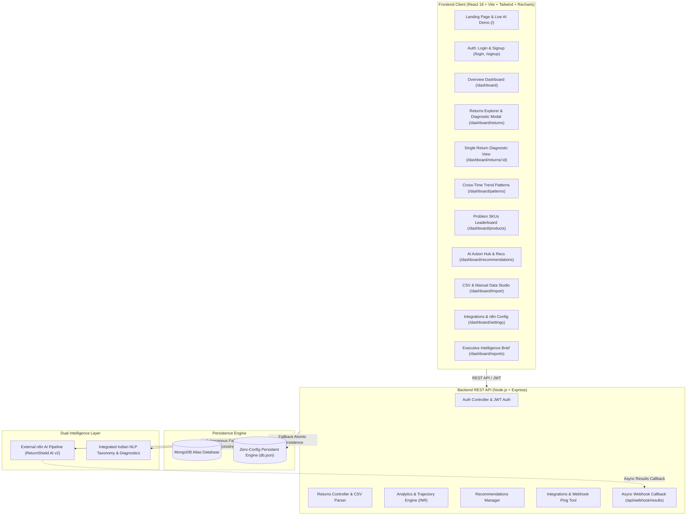
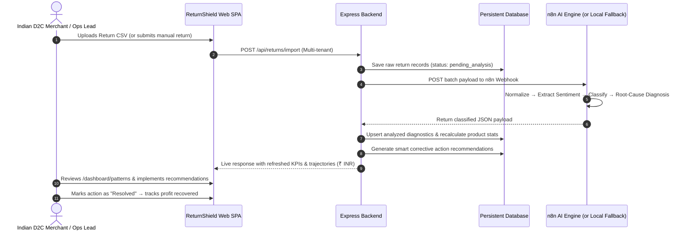

# 🛡️ ReturnShield AI — Autonomous Return & RTO Defense Platform

> **Transform unstructured e-commerce returns into persistent root-cause diagnostics, problem SKU leaderboards, and automated return & RTO prevention for Indian D2C brands.**

[](https://opensource.org/licenses/MIT)
[](https://reactjs.org/)
[](https://nodejs.org/)
[](https://tailwindcss.com/)
[](https://n8n.io/)
[](https://www.mongodb.com/)
[-orange.svg)](https://en.wikipedia.org/wiki/Indian_rupee)

---

## 📌 Executive Summary (Indian E-Commerce Context)

In Indian e-commerce (Shopify India, Myntra, Meesho, Amazon India, Ajio), brands lose **25% to 40% of their net margins** to recurring customer returns and Cash-On-Delivery (COD) **Return-To-Origin (RTO)** failures. High reverse courier freight (Delhivery, BlueDart, Shadowfax, Xpressbees), sizing mismatch in ethnic & western wear, studio photo color discrepancies, and fragile transit damage are silent margin killers.

Pure webhook-only AI automations suffer from a critical limitation: **without persistent cross-time data storage, they cannot detect recurring patterns across multi-week batches or track whether implemented corrective actions actually reduced return rates.**

**ReturnShield AI** solves this by wrapping an intelligent multi-tenant web application around the **n8n AI Engine ("ReturnShield AI v2")**, persisting return history across time, calculating dynamic **Product Priority Scores**, and closing the feedback loop with actionable recommendation tracking in **₹ INR**.

---

## 🏗️ System Architecture



---

## 🔄 End-to-End Data Pipeline Flow



---

## 🧠 Dual AI Engine Architecture

ReturnShield AI features a **dual-engine architecture** ensuring 100% operational uptime:

1. **n8n Workflow Connector (`ReturnShield AI v2`)**:
   - Dispatches return batches to external n8n workflows configured in `/dashboard/settings`.
   - Supports asynchronous callback via `POST /api/webhook/results`.
   - Includes a built-in **"Test Connection"** ping tool measuring round-trip network latency.

2. **Built-in Indian NLP Taxonomy & Diagnostic Engine**:
   - Runs automatically when external n8n instances are offline or in local demo mode.
   - Categorizes return comments into 6 distinct root-cause categories:
     - 📐 `Size & Fit Mismatch` (Kurti bodice, bust/shoulder, waist, inseam length, shoe toe-box)
     - ⚙️ `Quality / Manufacturing Defect` (Embroidery zari unraveling, button rivet shear, TWS charging pins, sole bonding)
     - 🎨 `Listing & Color Variance` (Studio strobe lighting hue delta on silk/cotton fabrics)
     - 📦 `Logistics & Transit Damage` (Courier conveyor crushing on Delhivery/BlueDart routes)
     - 🏷️ `Warehouse Fulfillment Error` (Barcode SKU staging mismatch)
     - 💡 `Buyer Remorse / Intent Shift` (Impulse buy consideration gap)
   - Generates precise engineering root causes and prescribed supplier/listing mitigations.

---

## 🗄️ Database Schema & Collections

| Collection | Key Fields | Description |
|---|---|---|
| `users` | `_id`, `name`, `email`, `password_hash`, `company_name`, `role`, `created_at` | Multi-tenant tenant accounts |
| `returns` | `_id`, `user_id`, `order_id`, `customer_name`, `product_id`, `product_name`, `product_price`, `customer_comment`, `return_reason_raw`, `ai_reason_category`, `ai_confidence`, `ai_root_cause`, `ai_mitigation_fix`, `severity`, `status`, `return_date` | Granular return records with full AI diagnostics in ₹ INR |
| `product_stats` | `_id`, `product_id`, `product_name`, `category`, `total_returns`, `return_rate`, `priority_score`, `estimated_financial_loss`, `top_reason`, `last_updated` | **Cross-time aggregated SKU statistics** (upserted across uploads) |
| `recommendations` | `_id`, `rule_key`, `product_id`, `product_name`, `text`, `category`, `priority`, `estimated_savings`, `status` (`todo` \| `in_progress` \| `done`), `created_at`, `resolved_at` | Actionable items tracked to closure in ₹ INR |
| `integrations` | `_id`, `user_id`, `n8n_webhook_url`, `google_sheet_id`, `api_key`, `sync_interval`, `auto_analyze` | Webhook endpoints and external keys |

---

## 📱 Page & Feature Guide (All 13 Routes)

### Public Pages
- **`/` — Landing Page**:
  - **Interactive Live AI Demo Widget**: Test raw customer complaints against the AI classifier with real-time root-cause synthesis.
  - **Interactive ROI Cost Savings Calculator in ₹ INR**: Dynamic sliders to estimate recoverable profit based on monthly orders, return rate, and AOV (₹).
  - **Architecture Flow & Feature Breakdown**.
  - **Pricing Tiers (₹ INR) & FAQ**.
- **`/login` — Sign In Page**:
  - Email/password authentication + **1-Click Demo Login button** for instant evaluation as `Sonu Jangir (BharatThreads Lifestyle)`.
- **`/signup` — Tenant Registration**:
  - Create custom brand workspaces with multi-tenant data isolation.
- **`*` — 404 Page**:
  - Custom error page with navigational recovery links.

### Authenticated Dashboard Routes
- **`/dashboard` — Overview Hub**:
  - Metric cards: Total Returns, RTO Rate %, Net Financial Loss (₹ INR), AI Diagnostic Confidence (95%), Active Recommendations.
  - Urgent Alert Banner for surging failure modes across Indian deliveries.
  - 14-day interactive Area Trend Chart (Daily Returns vs Fit Issues vs Defects).
  - Donut chart of AI Reason Distribution.
  - Top 4 Problem Products snapshot and live recent returns stream.
- **`/dashboard/returns` — Returns Diagnostic Explorer**:
  - Searchable and filterable data table (by Reason, Severity, Product, Date).
  - **CSV Bulk Export** with full diagnostic metadata in ₹ INR.
  - **Quick-View Modal** to inspect root-causes without leaving the table.
- **`/dashboard/returns/:id` — Single Return Diagnostic**:
  - Customer verbatim comment, AI confidence meter, and defect severity rating.
  - Diagnosed engineering root-cause and prescribed action.
  - **Related recurring returns for the same SKU** demonstrating multi-order patterns across time.
- **`/dashboard/patterns` — Cross-Time Trend Patterns**:
  - 4-week longitudinal trajectory charts.
  - Week-over-Week shift radar identifying **Surging**, **Declining**, and **Stable** return drivers.
  - Root-cause clustering breakdown across products.
- **`/dashboard/products` — Problem Products Leaderboard**:
  - SKUs ranked by dynamic **Priority Score** (`Return Rate × Volume × Financial Loss`).
  - Drill-down modal with primary failure mode analysis and supplier action plans.
- **`/dashboard/recommendations` — AI Action Hub**:
  - Corrective actions ranked by priority (Critical, High, Medium).
  - Status management (`To Do`, `In Progress`, `Resolved / Done`) to close the loop.
  - Real-time potential vs realized savings tally in ₹ INR.
- **`/dashboard/import` — Data Ingestion Studio**:
  - Drag-and-drop CSV batch uploader.
  - **1-Click "Download Sample CSV Template"** (with Indian apparel, footwear & electronics examples).
  - **1-Click "Load Pre-Configured Demo Returns"** (50+ realistic Indian records).
  - Manual single return submission form with immediate live AI classification.
- **`/dashboard/settings` — Integrations & n8n Manager**:
  - n8n Webhook URL manager with live **"Test Connection" ping tool** measuring latency.
  - Google Sheets integration and API key management.
- **`/dashboard/reports` — Executive Intelligence Brief**:
  - Printable C-level summary report with Indian reverse logistics cost driver breakdown (courier freight, QC, markdown) and ROI projections.

---

## 🛠️ Tech Stack & Dependencies

### Frontend
- **Framework**: React 18 (SPA) with Vite
- **Styling**: Tailwind CSS (Dark Glassmorphism design system)
- **Charts & Visualizations**: Recharts
- **Icons**: Lucide React
- **Routing**: React Router DOM v6

### Backend
- **Runtime**: Node.js (ES Modules)
- **Framework**: Express.js
- **Authentication**: JWT (JSON Web Tokens) & bcryptjs
- **File & CSV Processing**: Multer & csv-parser
- **HTTP Client**: Axios
- **Persistence**: MongoDB Atlas + Atomic JSON local persistent engine fallback

---

## ⚡ Quick Start & Local Installation

### Prerequisites
- Node.js (v18 or higher recommended)
- npm (v9 or higher)

### 1. Clone the Repository
```bash
git clone https://github.com/gintama1018/AGENTIC-AI-HACKATHON.git
cd AGENTIC-AI-HACKATHON
```

### 2. Install Dependencies
```bash
npm run install:all
```

### 3. Start the Development Servers
```bash
# Terminal 1: Start Backend API (Port 5000)
npm run server:dev

# Terminal 2: Start Frontend App (Port 5173)
npm run client
```

### 4. Access the Application
- **Frontend App**: [http://localhost:5173](http://localhost:5173)
- **Backend API Health**: [http://localhost:5000/api/health](http://localhost:5000/api/health)
- **Instant Login**: Click the **"1-Click Demo Login"** button on the sign-in page (`Sonu Jangir - BharatThreads`)!

---

## 🔌 API Reference

| Method | Endpoint | Description |
|---|---|---|
| `POST` | `/api/auth/login` | Sign in (or 1-click demo login) |
| `POST` | `/api/auth/signup` | Register new tenant profile |
| `GET` | `/api/auth/me` | Fetch authenticated session |
| `GET` | `/api/returns` | List returns (supports search, category, severity, pagination) |
| `GET` | `/api/returns/:id` | Get deep-dive return diagnostic by ID |
| `POST` | `/api/returns/import` | Upload CSV batch or JSON returns array |
| `POST` | `/api/returns/single` | Submit single return with instant AI classification |
| `POST` | `/api/returns/seed-demo` | Seed 50+ pre-configured 4-week Indian demo returns |
| `GET` | `/api/analytics/overview` | Fetch overview KPIs, timeline, and reason distribution |
| `GET` | `/api/analytics/patterns` | Fetch 4-week category trajectories and root-cause clusters |
| `GET` | `/api/analytics/products` | Fetch problem-product priority leaderboard |
| `GET` | `/api/analytics/financial-impact` | Fetch reverse logistics cost breakdown & savings (₹ INR) |
| `GET` | `/api/recommendations` | List AI recommendations with summary metrics |
| `PATCH` | `/api/recommendations/:id` | Update recommendation status (`todo`, `in_progress`, `done`) |
| `POST` | `/api/recommendations` | Log custom operations initiative |
| `GET` | `/api/settings/integration` | Fetch n8n webhook and Google Sheet configs |
| `PUT` | `/api/settings/integration` | Update integration settings |
| `POST` | `/api/settings/test-webhook` | Ping test target webhook URL and measure latency |
| `POST` | `/api/webhook/results` | Async callback endpoint for external n8n pipelines |

---

## 👥 Hackathon Submission Details

- **Project Name**: ReturnShield AI
- **Repository**: [https://github.com/gintama1018/AGENTIC-AI-HACKATHON](https://github.com/gintama1018/AGENTIC-AI-HACKATHON)
- **Author**: Sonu Jangir (`gintama1018`)
- **Email**: `Sonu.jangir2024@uem.edu.in`
- **Hackathon**: Agentic AI Hackathon 2026
