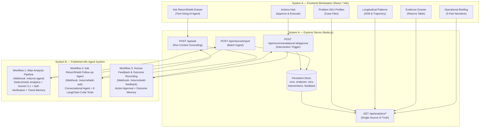

# 🛡️ ReturnShield AI — Production Return Intelligence & Action Engine

> **Human-Authored Operational Product for Indian D2C & E-Commerce Brands**  
> *Built for BharatThreads Lifestyle Pvt. Ltd. | Powered by Published n8n AI Agent Workflows + Google Gemini 3.1 Flash Lite*

[](https://github.com/gintama1018/AGENTIC-AI-HACKATHON)
[](LICENSE)
[](DESIGN.md)

---

## 🧭 Executive Overview

**ReturnShield AI** is a purpose-built return investigation and action system for e-commerce operators, logistics directors, and merchandising leads. 

Unlike conventional "analytics dashboards" that merely chart return rates, ReturnShield separates **RTO (Return to Origin)** from **Customer-Initiated Returns**, detects cross-dimensional problem hotspots, compares competing hypotheses with supporting and contradicting evidence, executes self-verification against model overclaiming, provides a **tool-using conversational investigation agent**, and closes the loop with **human-in-the-loop approvals and outcome tracking**.

```
USER UPLOADS DATA → EXPRESS (validate & normalize) → N8N WORKFLOW 1 (deterministic analytics + Gemini + self-verify) 
                                                  → STORE RUN & ANALYSIS IN DB 
                                                  → WORKSTATION (briefing, hypotheses, actions)
                                                  → N8N WORKFLOW 2 (6 LangChain tools for conversational Q&A)
                                                  → N8N WORKFLOW 3 (human approval & outcome learning)
```

---

## 🏛️ End-to-End System Architecture



---

## ⚡ The 3 Published n8n Workflows

### 1. Main Ingest & Analysis Pipeline (`return_shield_workflow_v3.json`)
- **Webhook Endpoint**: `POST /webhook/returns-agent`
- **Execution Chain**:
  1. `Normalize & Validate Data`: Generates unique `run_id`, caps input at 5,000 rows with truncation flag, resolves 25+ alias headers.
  2. `Data Quality Check`: Audits missing fields, identifies data gaps without blocking execution.
  3. `Deterministic Analytics Engine`: Calculates SKU, courier, pincode, zone, and payment method aggregations and uplift ratios.
  4. `Compute Trend Delta`: Reads `$getWorkflowStaticData('global')` and computes `change_since_last_analysis`.
  5. `Reason Classifier (Gemini 3.1 Flash Lite)`: Multilingual classification (including Hinglish) with retry/backoff.
  6. `Root-Cause Synthesizer`: Produces 1–3 competing hypotheses per problem with supporting vs. contradicting evidence and `next_test`.
  7. `Priority & Impact Engine`: Assigns P0–P3 priority tiers gated on `MIN_SAMPLE` sufficiency thresholds.
  8. `Recommendation Agent`: Generates data-backed actions with expected metrics and measurement plans.
  9. `Self-Verification Engine`: Deterministic 6-check audit that demotes unverified claims and flags consequential actions for human approval.
  10. `Final JSON Builder`: Assembles canonical response payload and logs run snapshots.

### 2. Tool-Using "Ask ReturnShield" Agent (`return_shield_ask_agent_workflow.json`)
- **Webhook Endpoint**: `POST /webhook/returnshield-ask`
- **6 LangChain Code Tools**:
  - `get_segment_metrics`: Queries specific dimension/value metrics (e.g. `courier:Xpress Logistics`).
  - `get_reason_distribution`: Returns returned vs. RTO reason category breakdowns.
  - `get_top_problems`: Queries ranked P0–P3 problems.
  - `get_recommendations`: Filters prescribed actions by priority tier.
  - `compare_to_previous_run`: Retrieves trend delta against the prior run.
  - `get_hypotheses`: Retrieves competing explanations and next test procedures.
- **Output Schema**: `{ "answer": "...", "confidence": 0.95, "caveats": [...], "tools_used": [...] }`.

### 3. Feedback & Human-in-the-Loop Recording (`return_shield_feedback_workflow.json`)
- **Webhook Endpoint**: `POST /webhook/returnshield-feedback`
- **Purpose**: Records human approvals for consequential recommendations (e.g. COD OTP verification, supplier quarantine) and logs closed-loop outcome verifications.

---

## 🇮🇳 Indian D2C Fashion & Logistics Context

ReturnShield is calibrated for Indian retail logistics:
- **Currency & Denominations**: ₹ INR (₹ Lakhs / ₹ Crores formatting).
- **Logistics Partners**: BlueDart, Delhivery, Xpressbees, Shadowfax.
- **Reverse Logistics Math**: Return courier freight (~₹120) + reverse QC & restocking (~₹60) + 25% depreciation markdown.
- **Payment Split**: Strict separation of Cash on Delivery (COD) NDR/refusal patterns from prepaid returns.
- **Multilingual Support**: Natural parsing of Hinglish comments (e.g., *"size chhota hai"*, *"quality bekar thi"*, *"delivery boy nahi aaya"*).

---

## 🛠️ Project Structure

```
AGENTIC-AI-HACKATHON/
├── client/                               # System A: React + Vite Frontend
│   ├── src/
│   │   ├── components/
│   │   │   ├── layout/                   # Left rail DashboardLayout & Navbar
│   │   │   └── ui/                       # Badge, AskReturnShieldDrawer, etc.
│   │   ├── pages/dashboard/              # 8 Workstation Pages
│   │   │   ├── OverviewPage.jsx          # 5-Part Briefing Narrative
│   │   │   ├── ReturnsPage.jsx           # Returns Investigation Table
│   │   │   ├── PatternsPage.jsx          # Longitudinal Shift & Trajectories
│   │   │   ├── ProductsPage.jsx          # Problem SKU Case Files
│   │   │   ├── RecommendationsPage.jsx   # Actions Hub & Approval Flow
│   │   │   ├── ImportPage.jsx            # 5-Stage Drag-and-Drop Ingestion
│   │   │   ├── ReportsPage.jsx           # Executive Brief Export
│   │   │   └── SettingsPage.jsx          # Webhook & Key Management
│   │   └── services/api.js               # Unified API Client
├── server/                               # System A: Express REST Server
│   ├── src/
│   │   ├── config/db.js                  # Persistent Storage (runs, analyses, etc.)
│   │   ├── controllers/                  # Returns, Analytics, Ask, Recommendations
│   │   ├── routes/                       # Express API Routes
│   │   └── services/
│   │       ├── n8nClient.js              # Authoritative n8n Dispatcher & Retry
│   │       └── aiEngine.js               # Deterministic Fallback Engine
├── files (4)/                            # System B: Published n8n Workflows
│   ├── return_shield_workflow_v3.json    # Workflow 1 (Main Ingest & Analytics)
│   ├── return_shield_ask_agent_workflow.json # Workflow 2 (Tool-Using Ask Agent)
│   ├── return_shield_feedback_workflow.json  # Workflow 3 (Feedback & Approval)
│   ├── RETURN_SHIELD_ARCHITECTURE_V3.md  # 35-Section Architecture Spec
│   └── test_suite.md                     # 12-Case Test Specification (A–L)
└── README.md
```

---

## 🚀 Quick Start Guide

### Prerequisites
- Node.js (v18+)
- npm (v9+)
- n8n instance (optional for local mock fallback; required for live cloud workflows)

### 1. Backend Setup
```bash
cd server
npm install

# Copy example environment configuration
cp .env.example .env

# Start backend server
npm run dev
# Server running on http://localhost:5000
```

### 2. Frontend Setup
```bash
cd client
npm install

# Start Vite development server
npm run dev
# Workstation running on http://localhost:5173
```

---

## 🔒 Security & Credential Hygiene
- All n8n webhook URLs, secrets, and API credentials are kept strictly in server-side `.env` configuration (ignored in `.git`).
- Zero secret leakage in client-side Vite bundles.
- All requests between Express and n8n use secure header authentication (`X-Webhook-Secret`).

---

## 👥 Authors & Maintainers
- **Sonu Jangir** — *Lead Architect & Engineer* (Sonu.jangir2024@uem.edu.in)
- **Repository**: [gintama1018/AGENTIC-AI-HACKATHON](https://github.com/gintama1018/AGENTIC-AI-HACKATHON)
