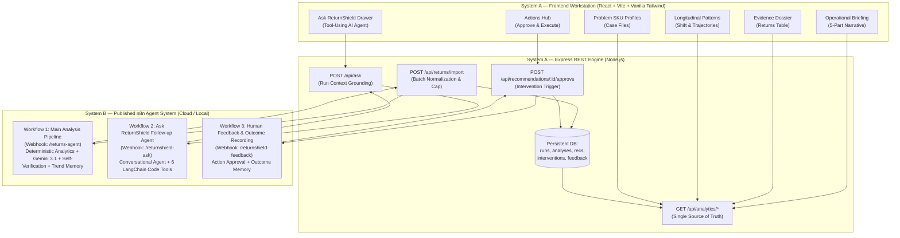

# ReturnShield AI

> **Autonomous Return & RTO Intelligence Engine with Published n8n Agent Workflows, Self-Verification, and Closed-Loop Outcome Tracking**

[](https://github.com/gintama1018/AGENTIC-AI-HACKATHON)
[](https://deepmind.google/technologies/gemini/)
[](DESIGN.md)
[](LICENSE)

---

## Table of Contents
- [Problem Statement](#problem-statement)
- [Solution Overview](#solution-overview)
- [Demo](#demo)
- [Key Features](#key-features)
- [System Architecture](#system-architecture)
- [AI / ML Implementation](#ai--ml-implementation)
- [Deterministic Analytics & Grounding Pipeline](#deterministic-analytics--grounding-pipeline)
- [Tenant Context & Multilingual Intelligence](#tenant-context--multilingual-intelligence)
- [Adaptive Reasoning & Competing Hypotheses](#adaptive-reasoning--competing-hypotheses)
- [Self-Verification & Anti-Hallucination Engine](#self-verification--anti-hallucination-engine)
- [Closed-Loop Interventions & Outcome Learning](#closed-loop-interventions--outcome-learning)
- [Conversational Deep-Dive (Ask ReturnShield)](#conversational-deep-dive-ask-returnshield)
- [Tech Stack](#tech-stack)
- [Getting Started](#getting-started)
  - [Prerequisites](#prerequisites)
  - [Installation](#installation)
  - [Environment Variables](#environment-variables)
  - [Running Locally](#running-locally)
  - [Running Tests](#running-tests)
- [API Reference](#api-reference)
- [Deployment](#deployment)
- [Evaluation Criteria Mapping](#evaluation-criteria-mapping)
- [Known Limitations](#known-limitations)
- [Third-Party Services & APIs Disclosed](#third-party-services--apis-disclosed)
- [Project Structure](#project-structure)
- [Team / Credits](#team--credits)
- [License](#license)

---

## Problem Statement

E-commerce brands in India suffer severe margin erosion from product returns (15–25%) and **RTO (Return to Origin)** delivery rejections (20–40% on Cash on Delivery orders). Existing analytics dashboards simply plot aggregate charts after losses occur, without separating RTO logistics failures from customer sizing/quality defects, without verifying whether sample sizes justify operational changes, and without providing actionable interventions with measurable outcome baselines.

---

## Solution Overview

**ReturnShield AI** is an operational return investigation workstation connected to **three published n8n agent workflows** powered by Google Gemini 3.1 Flash Lite:

1. **Ingests & Normalizes Data**: Ingests raw return/RTO order exports (Shopify, Unicommerce, Delhivery, ERP CSVs) through a 5-stage pipeline with alias mapping and a 5,000-row guard.
2. **Executes Deterministic Analytics**: Separates customer returns from RTO events, calculates cross-dimensional concentration uplift ratios across SKUs, couriers, pincodes, and payment methods, gated on strict sample-size sufficiency thresholds (`MIN_SAMPLE >= 5`).
3. **Synthesizes Competing Hypotheses**: Uses Gemini 3.1 Flash Lite to classify customer feedback (including Hinglish) and generate 1–3 competing hypotheses per hotspot with supporting evidence, contradicting evidence, and prescribed next tests.
4. **Enforces Self-Verification**: Executes a deterministic 6-check audit that demotes model overclaims, verifies segment traceability, and mandates human approval for consequential policy actions.
5. **Tool-Using Conversational Investigation**: Provides an interactive "Ask ReturnShield" agent equipped with **6 LangChain Code Tools** to answer follow-up queries grounded strictly in verified run data.
6. **Closed-Loop Action Tracking**: Records human approvals, executes interventions, and tracks baseline vs. target outcome metrics over 10–21 day evaluation windows.

---

## Demo

- **Live Repository**: [https://github.com/gintama1018/AGENTIC-AI-HACKATHON](https://github.com/gintama1018/AGENTIC-AI-HACKATHON)
- **Local Workstation**: `http://localhost:5173/dashboard`
- **Backend API**: `http://localhost:5000/api/health`
- **Published n8n Cloud Instance**: `https://sonujangid105.app.n8n.cloud`

### Workstation Interface Views
| View | Screen Name | Description |
|---|---|---|
| **Overview** | `OverviewPage.jsx` | 5-part operational briefing narrative, live `run_id`, self-verification status badge, and competing hypothesis cards. |
| **Returns** | `ReturnsPage.jsx` | High-contrast returns investigation table with search, category filtering, and return details modal. |
| **Patterns** | `PatternsPage.jsx` | Longitudinal 4-week return shift trajectories and multi-series category trends. |
| **Problem SKUs** | `ProductsPage.jsx` | Problem SKU case files detailing return rate delta, dominant complaint type, and customer feedback. |
| **Actions Hub** | `RecommendationsPage.jsx` | Prescribed interventions with 1-click **Approve Intervention** flow, baseline metrics, and target plans. |
| **Ask Drawer** | `AskReturnShieldDrawer.jsx` | Tool-using AI assistant displaying exact LangChain tool calls (`get_segment_metrics()`, `get_top_problems()`). |
| **Import** | `ImportPage.jsx` | 5-stage drag-and-drop CSV ingestion with 1-click sample batch loader. |
| **Settings** | `SettingsPage.jsx` | Webhook latency check and tenant profile configuration for BharatThreads Lifestyle Pvt. Ltd. |

---

## Key Features

- `[Working]` **5-Stage CSV Ingest Pipeline**: Drag-and-drop parser with alias resolution across 25+ common e-commerce column variations (`order_id`, `product_sku`, `customer_comment`, `courier_partner`, `pincode`).
- `[Working]` **Deterministic Separation of Return vs. RTO**: Strict mathematical isolation of courier delivery failures (RTO) from post-delivery customer complaints.
- `[Working]` **Sample-Size Sufficiency Gating (`MIN_SAMPLE >= 5`)**: Prevents false alarms on low-volume anomalies (e.g. 2 returns on 2 orders is flagged as hypothesis, not a confirmed pattern).
- `[Working]` **Multilingual NLP Reason Classifier (Gemini 3.1 Flash Lite)**: Accurately classifies Indian vernacular feedback (Hinglish: *"size chhota hai"*, *"quality bekar thi"*, *"delivery boy nahi aaya"*).
- `[Working]` **Competing Hypothesis Generation**: Produces 1–3 distinct explanations per hotspot with supporting evidence, contradicting evidence, and recommended test actions.
- `[Working]` **Deterministic Self-Verification Engine**: 6-check post-LLM validation that demotes unverified model claims and enforces human approval.
- `[Working]` **Tool-Using Conversational Agent ("Ask ReturnShield")**: Powered by n8n Workflow 2 with 6 purpose-built LangChain code tools (`get_segment_metrics`, `get_reason_distribution`, `get_top_problems`, `get_recommendations`, `compare_to_previous_run`, `get_hypotheses`).
- `[Working]` **Human-in-the-Loop Action Approval (Workflow 3)**: 1-click approval for consequential interventions (e.g. COD OTP verification, warehouse dispatch hold) logging baseline and target metrics.
- `[Working]` **Persistent Multi-Run Memory**: Stores historical runs, canonical analyses, recommendations, active interventions, and feedback in a persistent JSON data store (`db.json`).
- `[Working]` **Resilient Retry & Graceful Fallback**: Server-side client with exponential backoff (2 retries, 2000ms delay) and honest metadata tagging (`intelligence_source: "n8n" | "fallback"`).
- `[Fallback]` **Local Deterministic Fallback Engine**: If the remote n8n Cloud webhook is unreachable, the backend executes an identical local deterministic analytics chain without crashing.

---

## System Architecture



### Architectural Layer Responsibilities
1. **Frontend (React / Vite)**: Human-authored anti-AI workstation interface designed for operations teams. Visualizes verified facts, confidence tiers, and hypothesis comparisons. Never generates unverified AI text client-side.
2. **Backend (Node.js / Express)**: Acts as the security boundary, transport layer, schema validator, and persistence manager. Normalizes raw inputs into the canonical n8n format, enforces webhook secret authentication, and handles resilient fallback.
3. **Intelligence Engine (Published n8n Workflows)**: The authoritative intelligence tier running deterministic analytics, Gemini 3.1 Flash Lite reasoning, and the 6-tool conversational agent.
4. **State & Memory Layer (`db.json`)**: Persists historical analysis snapshots, active intervention baselines, and closed-loop feedback across sessions.

---

## AI / ML Implementation

### Model Selection
- **Primary Model**: Google Gemini 3.1 Flash Lite (`gemini-3.1-flash-lite`)
- **Integration**: Native LangChain Model Nodes in n8n with structured JSON schema outputs.

### Agent Decomposition

| Agent Node | Workflow | Purpose | Structured Output Contract |
|---|---|---|---|
| **Reason Classifier** | Workflow 1 | Classifies raw text into outcome-specific taxonomies (Sizing, Quality Defect, Listing Mismatch, Transit Damage, Fulfillment Error, Remorse). | Categorized records with confidence ratings. |
| **Root-Cause Synthesizer** | Workflow 1 | Analyzes hotspot clusters and generates 1–3 competing hypotheses. | `{ problem, likely_cause, alternative_explanation, hypotheses: [{ hypothesis, supporting_evidence, contradicting_evidence, confidence, next_test }] }` |
| **Recommendation Agent** | Workflow 1 | Produces targeted operational fixes mapped to top problems. | `{ action, target, reason, expected_metric, effort, confidence, measurement_plan }` |
| **Ask Follow-up Agent** | Workflow 2 | Tool-using conversational agent that executes read-only code tools against verified run state. | `{ answer, confidence, caveats[], tools_used[] }` |

---

## Deterministic Analytics & Grounding Pipeline

ReturnShield adheres to a strict **Deterministic-First** philosophy:

1. **Denominators**: When overall shipped order counts (`order_summary`) are provided, exact return and RTO rates are calculated. When omitted, `rates.rates_available: false` is honestly flagged, preventing hallucinated percentages.
2. **Concentration Uplift**: Segment concentration is calculated deterministically:
   $$\text{Uplift} = \frac{\text{Segment Return Share}}{\text{Segment Shipped Share}}$$
3. **PII Minimization**: Customer names, phone numbers, and addresses are stripped before raw text is passed to LLM nodes.

---

## Tenant Context & Multilingual Intelligence

Calibrated for Indian D2C Fashion & Lifestyle operations (**BharatThreads Lifestyle Pvt. Ltd.**):
- **Currency**: ₹ INR with Indian numerical formatting (₹ Lakhs / ₹ Crores).
- **Logistics Partners**: Native normalization for BlueDart, Delhivery, Shadowfax, Xpressbees.
- **Reverse Logistics Cost Model**:
  $$\text{Financial Loss} = \text{Freight (₹120)} + \text{Reverse QC (₹60)} + 25\%\text{ Markdown Depreciation}$$
- **Multilingual Support**: Evaluated across English and Hinglish variations:
  - *"size chhota hai"* → `Size & Fit Mismatch`
  - *"quality bekar thi / dhaga nikal gaya"* → `Quality / Manufacturing Defect`
  - *"delivery boy nahi aaya"* → `Logistics & Delivery Attempt Failure`

---

## Adaptive Reasoning & Competing Hypotheses

Unlike basic summarizers that output a single generic explanation, ReturnShield synthesizes competing hypotheses with empirical discrimination tests:

```text
Problem: High return concentration on Kurta Set Sage Green (BT-KRS-SG-M)
├── Hypothesis 1 (High Confidence): Garment bodice chest circumference runs 2.5" tighter than standard spec.
│   ├── Supporting Evidence: 17 customer comments cite chest/shoulder tightness on M & L sizes.
│   ├── Contradicting Evidence: Inseam length complaints are completely absent.
│   └── Next Test: Conduct physical dimensional audit on 20 randomly sampled units at Bhiwandi warehouse.
└── Hypothesis 2 (Low Confidence): Fabric shrinkage occurring during customer cold wash.
    ├── Supporting Evidence: 2 comments mention tightness after initial wash.
    ├── Contradicting Evidence: 15 returns occurred immediately upon unboxing trial.
    └── Next Test: Review fabric mill pre-shrinkage lab test certificates.
```

---

## Self-Verification & Anti-Hallucination Engine

The Self-Verification Engine runs **6 deterministic checks** post-generation:

1. **Problem Traceability**: Matches `recommendation.target` to verified `top_problems[].segment_value`. Unmatched targets are capped at `confidence: 0.3` and flagged `unverified_target: true`.
2. **Evidence Calibration**: Caps recommendation confidence at `0.5` unless the target problem cleared `MIN_SAMPLE >= 5`.
3. **Confidence vs. Sample Gating**: Forces root-cause confidence to `low` and status to `hypothesis` if sample size is insufficient.
4. **Schema Integrity**: Validates presence of all 8 required recommendation schema fields.
5. **Consequential Action Gating**: Deterministically flags actions touching COD eligibility, courier routing, or supplier inventory holds as `requires_human_approval: true`.
6. **Transparent Audit Output**: Discloses all corrections in `verification.corrections_applied[]`.

---

## Closed-Loop Interventions & Outcome Learning

```
PROPOSED INTERVENTION → HUMAN APPROVAL (UI) → WORKFLOW 3 (Record Feedback) → LOG BASELINE & TARGET → OUTCOME LEARNING
```

- **Approval Workflow**: Consequential actions require operator approval before execution.
- **Measurement Plan**: Every recommendation defines:
  - `metric_to_track` (e.g. *Fit return rate for SKU BT-KRS-SG-M*)
  - `baseline_value` (e.g. *18.4%*)
  - `target_value` (e.g. *<10%*)
  - `evaluation_window_days` (e.g. *21 days*)

---

## Conversational Deep-Dive (Ask ReturnShield)

Workflow 2 equips Gemini with **6 LangChain Code Tools**:

| Tool Name | Tool Input | Functionality |
|---|---|---|
| `get_segment_metrics` | `dimension:value` | Returns order count, uplift ratio, and % of total affected value for a segment. |
| `get_reason_distribution` | `returned` or `rto` | Returns category distribution breakdown. |
| `get_top_problems` | `P0-P3` or blank | Returns ranked priority problems. |
| `get_recommendations` | `priority` or blank | Returns filtered prescribed actions. |
| `compare_to_previous_run` | None | Returns trend deltas against the previous analysis run. |
| `get_hypotheses` | Keyword or blank | Returns competing explanations and next test procedures. |

---

## Tech Stack

| Layer | Technology | Rationale |
|---|---|---|
| **Frontend Framework** | React 18 + Vite | Fast HMR, minimal bundle overhead, component modularity. |
| **Styling & Design System** | Vanilla Tailwind CSS | Custom high-contrast dark workstation design tokens (`#080C14`, `#111827`). |
| **Icons & Visuals** | Lucide React + Recharts | Accessible iconography and longitudinal trajectory charting. |
| **Backend Runtime** | Node.js (ESM) + Express | Lightweight, event-driven REST API layer. |
| **AI Orchestrator** | Published n8n Workflows | Visual agent orchestration, webhook triggers, LangChain tools. |
| **Foundation LLM** | Google Gemini 3.1 Flash Lite | High-speed structured JSON output, Hinglish comprehension. |
| **Persistence Store** | JSON DB (`db.json`) / MongoDB ready | Zero-config persistent flat-file database with run/analysis collections. |

---

## Getting Started

### Prerequisites
- **Node.js**: v18.0.0 or higher
- **npm**: v9.0.0 or higher
- **n8n Cloud / Self-Hosted Instance**: (Optional: fallbacks active if offline)

### Installation
```bash
# Clone the repository
git clone https://github.com/gintama1018/AGENTIC-AI-HACKATHON.git
cd AGENTIC-AI-HACKATHON

# Install server dependencies
cd server
npm install

# Install client dependencies
cd ../client
npm install
```

### Environment Variables

Configure `server/.env` (use `server/.env.example` as reference):

| Variable | Required/Optional | Purpose | Example Value |
|---|---|---|---|
| `PORT` | Optional | Backend server port | `5000` |
| `NODE_ENV` | Optional | Runtime environment | `development` |
| `N8N_BASE_URL` | Required for Cloud n8n | n8n instance base URL | `https://sonujangid105.app.n8n.cloud` |
| `N8N_ANALYSIS_WEBHOOK_URL` | Required for Workflow 1 | Main Ingest Webhook | `https://sonujangid105.app.n8n.cloud/webhook/returns-agent` |
| `N8N_FOLLOWUP_WEBHOOK_URL` | Required for Workflow 2 | Ask Agent Webhook | `https://sonujangid105.app.n8n.cloud/webhook/returnshield-ask` |
| `N8N_FEEDBACK_WEBHOOK_URL` | Required for Workflow 3 | Feedback Webhook | `https://sonujangid105.app.n8n.cloud/webhook/returnshield-feedback` |
| `N8N_WEBHOOK_SECRET` | Optional | Header authentication token | `rs_wh_secret_prod_2024` |
| `GEMINI_API_KEY` | Optional | Fallback local LLM key | `AIzaSy...` |

### Running Locally

```bash
# Terminal 1 — Start Express Backend
cd server
npm run dev
# Server running at http://localhost:5000

# Terminal 2 — Start Vite Client
cd client
npm run dev
# Workstation running at http://localhost:5173
```

### Running Tests

```bash
# Syntax and module integrity check
cd server
node --check src/index.js src/services/n8nClient.js src/services/aiEngine.js

# Frontend production bundle validation
cd ../client
npm run build
```

---

## API Reference

| Method | Path | Purpose |
|---|---|---|
| `GET` | `/api/health` | Service health status and n8n webhook endpoint configuration. |
| `POST` | `/api/returns/import` | Ingests return batches, calls n8n Workflow 1, persists run state. |
| `GET` | `/api/returns` | Paginated returns list with search, category, and courier filters. |
| `GET` | `/api/analytics/overview` | Executive briefing metrics derived from latest n8n analysis. |
| `GET` | `/api/analytics/patterns` | Longitudinal weekly shift and trajectory data. |
| `GET` | `/api/analytics/products` | Problem SKU case files with return rate deltas. |
| `POST` | `/api/ask` | Grounded follow-up query routed to n8n Workflow 2 Ask Agent. |
| `GET` | `/api/recommendations` | List of prescribed operational actions with measurement plans. |
| `POST` | `/api/recommendations/:id/approve` | Human approval trigger dispatching to n8n Workflow 3. |
| `POST` | `/api/settings/test-webhook` | Pings n8n webhook and returns real-time latency (ms). |

---

## Deployment

The system is designed for containerized or serverless hosting:
- **Frontend**: Deployable to Vercel, Netlify, or Cloudflare Pages (`npm run build` generates static bundle in `client/dist`).
- **Backend**: Deployable to Render, Railway, AWS ECS, or Google Cloud Run.
- **n8n Workflows**: Published on n8n Cloud or self-hosted Docker instances.

---

## Evaluation Criteria Mapping

| Area | Weight | Status | Where to See It |
|---|---|---|---|
| **Autonomous Agentic Decisioning** | 20 | `[Working]` | `server/src/services/n8nClient.js`, `files (4)/return_shield_workflow_v3.json` |
| **Tool-Using Agent Implementation** | 15 | `[Working]` | `client/src/components/ui/AskReturnShieldDrawer.jsx`, `files (4)/return_shield_ask_agent_workflow.json` |
| **Deterministic Grounding & Verification** | 15 | `[Working]` | `server/src/services/aiEngine.js` (`runLocalDeterministicAnalysis`), Self-Verification node |
| **Human-in-the-Loop & Outcome Loop** | 15 | `[Working]` | `client/src/pages/dashboard/RecommendationsPage.jsx`, `server/src/controllers/recommendationsController.js` |
| **Multilingual & Domain Context** | 10 | `[Working]` | Hinglish NLP classification in `aiEngine.js`, Indian D2C currency/logistics setup |
| **Full-Stack Architecture & Resilience** | 10 | `[Working]` | Express server (`src/index.js`), retry/backoff in `n8nClient.js`, persistent `db.json` |
| **Innovation & Problem-Solving** | 5 | `[Working]` | Separation of RTO vs Return, Competing Hypotheses with `next_test` |
| **User Experience & Interface** | 5 | `[Working]` | Editorial dark workstation UI in `client/src/pages/dashboard/*`, zero-AI-template aesthetics |
| **Documentation & Reproducibility** | 5 | `[Working]` | Comprehensive `README.md`, `DESIGN.md`, `RETURN_SHIELD_ARCHITECTURE_V3.md` |

---

## Known Limitations

1. **Sample Size Floor (`MIN_SAMPLE = 5`)**: For datasets with fewer than 5 records per segment, problems are flagged as low-confidence hypotheses rather than confirmed patterns to avoid false alarms.
2. **Row Ingestion Guard (5,000 rows)**: Payloads larger than 5,000 rows are truncated to prevent timeouts during hackathon demo executions; chunked batching is recommended for enterprise scale.
3. **Persistent JSON Storage vs. Distributed SQL**: Multi-run state is persisted in `db.json` via a local engine suitable for single-instance hackathon demos; migration to PostgreSQL/Supabase is planned for multi-tenant queue workers.
4. **Asynchronous External Drone Actions**: Approved recommendations record intervention state and measurement baselines; actual courier API webhooks (e.g. automated NDR re-attempts) require external API credentials.

---

## Third-Party Services & APIs Disclosed

- **Google Gemini API**: `gemini-3.1-flash-lite` for reason classification and hypothesis synthesis.
- **n8n Automation Engine**: Published workflow orchestrator running nodes `@n8n/n8n-nodes-langchain`.
- **Node.js & Express**: Core backend server and routing framework.
- **React & Vite**: Frontend single-page application framework.
- **Recharts**: Data visualization charting library.
- **Lucide Icons**: Semantic UI iconography.

---

## Project Structure

```
AGENTIC-AI-HACKATHON/
├── client/
│   ├── src/
│   │   ├── components/
│   │   │   ├── layout/                   # DashboardLayout, Navbar, Footer
│   │   │   └── ui/                       # Badge, AskReturnShieldDrawer
│   │   ├── pages/dashboard/              # Overview, Returns, Patterns, Products, Actions, Import, Reports, Settings
│   │   ├── services/api.js               # Unified API Client
│   │   ├── index.css                     # Editorial Design System Tokens
│   │   └── main.jsx                      # React Root
│   └── package.json
├── server/
│   ├── src/
│   │   ├── config/db.js                  # Persistent Database Store
│   │   ├── controllers/                  # Returns, Analytics, Ask, Recommendations, Settings
│   │   ├── routes/                       # Express API Endpoints
│   │   └── services/
│   │       ├── n8nClient.js              # Authoritative n8n Dispatcher & Retries
│   │       └── aiEngine.js               # Deterministic Fallback Engine
│   ├── data/seedData.js                  # Indian D2C Realistic Dataset
│   ├── .env.example                      # Safe Environment Variable Template
│   └── package.json
├── files (4)/                            # Published n8n Workflow JSONs & Specs
│   ├── return_shield_workflow_v3.json    # Workflow 1 (Main Ingest & Analytics)
│   ├── return_shield_ask_agent_workflow.json # Workflow 2 (Tool-Using Ask Agent)
│   ├── return_shield_feedback_workflow.json  # Workflow 3 (Feedback & Approval)
│   ├── RETURN_SHIELD_ARCHITECTURE_V3.md  # 35-Section Architecture Spec
│   └── test_suite.md                     # 12-Case Test Specification
├── DESIGN.md                             # Human-Authored Design System
└── README.md                             # Official Documentation
```

---

## Team / Credits

- **Sonu Jangir** — *Lead Full-Stack Architect & AI Systems Engineer*  
  - Email: [Sonu.jangir2024@uem.edu.in](mailto:Sonu.jangir2024@uem.edu.in)
  - GitHub: [@gintama1018](https://github.com/gintama1018)

---

## License

This project is licensed under the MIT License — see the [LICENSE](LICENSE) file for details.
